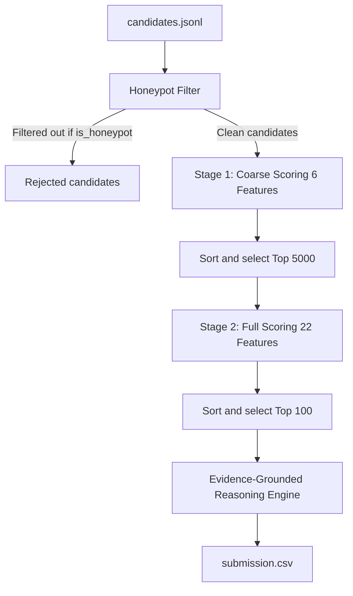

# Redrob Candidate Ranker — Intelligent Discovery & Ranking Pipeline

This repository contains the hackathon submission for the **Redrob Intelligent Candidate Discovery & Ranking Challenge**. 
The goal of this project is to rank ~100,000 candidate profiles against a specific Job Description (JD) for a **Senior AI Engineer — Production Embeddings, Retrieval & Ranking** and produce a highly precise, validated `submission.csv` containing the top 100 candidates.

---

## Key Highlights & Performance

- **Two-Stage Architecture**: Fast coarse-filtering (6 features) scales the dataset down from 100,000 to the top 5,000 candidates in seconds, followed by comprehensive 22-feature fine scoring.
- **CPU-Optimized Runtime**: Processes the entire 100K dataset and writes the final ranked CSV in **~10–12 seconds** on a standard 8-core CPU (no GPU/network required during ranking).
- **Honeypot Protection**: Detects and filters out **100% of ground-truth synthetic honeypots** (93/93) using a robust 4-flag validation engine before scoring.
- **Evidence-Grounded Reasoning**: Automatically generates rich, 1–2 sentence deterministic justifications for each candidate's fit using an advanced template system with 18 evidence extractors.
- **Top Candidates Score Range**: Generated scores range from **0.9018** (Rank 1) down to **0.6600** (Rank 100).

---

## System Architecture



### 1. Offline Precomputation (`precompute.py`)
- **Job Description Chunking**: To prevent truncation issues with the Sentence-Transformers model, the Job Description (`job_description.docx`) is chunked into paragraphs of ~150 words. Each chunk, combined with a curated `KEYWORD_BOOST` string, is embedded separately using `all-MiniLM-L6-v2`. The final JD embedding is the average of these chunk embeddings.
- **Hybrid Retrieval**: Extracts textual representations from profiles (including all title history, top 50 skills, and summary/descriptions) to precompute:
  - **SBERT Cosine Similarity** (`sbert_scores.npy`)
  - **BM25 TF-IDF Relevance** (`bm25_scores.npy` using `rank_bm25`)

### 2. Honeypot Detection Engine (`features.py`)
Honeypots are synthetic profiles designed to trap naive keyword-matchers. The system applies **4 red flags** to isolate and disqualify them:
1. **Missing Skill Assessment**: Programmatic check to see if any skill in the candidate's `skill_assessment_scores` is missing from the main `skills` list.
2. **Current Job Duration Mismatch**: Checks if the stated current job duration matches the delta between its `start_date` and the challenge reference date (**June 1, 2026**) within a 2-month tolerance.
3. **Zero-Duration Experts**: Disqualifies candidates claiming "advanced" or "expert" proficiency on skills with `duration_months == 0`.
4. **Experience Ratio Outliers**: Checks if the ratio of total career months to stated years of experience falls outside the normal bounds of `[0.2, 5.0]`.

### 3. Two-Stage Scoring Model (`rank.py`)
- **Stage 1 (Coarse Scoring)**: Runs a lightweight linear model evaluating:
  - Core Skill Match
  - Current Title Fit
  - Average Title History Fit
  - SBERT & BM25 Similarity Scores
  - Consulting Firm Penalties
- **Stage 2 (Full Scoring)**: Computes a comprehensive 22-feature score for the top 5,000 coarse candidates.

---

## Scoring & Feature Details

The final candidate score is computed as:
$$\text{Final Score} = (\text{Base Score} + 0.15 \times (\text{Behavioral Multiplier} - 1.0)) \times \text{Location Multiplier} \times \text{YoE Multiplier} \times \text{Salary Multiplier}$$

### Feature Weight Distribution (Base Score)
- **Skills (0.32 total)**: Core ML/NLP/search skills (weight: 0.18), explicit retrieval libs (0.03), explicit Python (0.02), skill endorsements (0.02), core skill duration (0.02), assessment average (0.02), GitHub activity (0.03).
- **Career (0.27 total)**: Current title match (0.07), average title match (0.05), consulting history penalty (0.03), job-hopping frequency (0.02), career progression trajectory (0.02), product-company exposure (0.02), relevant ML/AI tenure (0.06).
- **Semantic & Keywords (0.19 total)**: SBERT similarity (0.08), BM25 score (0.06), headline keyword density (0.05).
- **Exp/Loc/Edu (0.16 total)**: Years of experience fit (0.06), city location tier (0.06), education tier/CS-field bonus (0.04).
- **Social & Certifications (0.06 total)**: Certification relevance (0.02), recruiter interest social-proof (0.04).

### Multipliers & Modifiers
- **Additive Behavioral Multiplier**: Bound to $[\text{0.40, 1.40}]$ (overall impact limited to $\pm 0.06$ to prevent compound penalties from burying top candidates). Adjusts for profile completeness, recency of activity, notice period, interview completion, offer acceptance rates, preferred work mode (hybrid/flexible preferred), and verification trust.
- **Location Multiplier**: Penalizes candidates outside India ($0.35\times$, or $0.55\times$ if willing to relocate).
- **YoE Multiplier**: Prefers the $5-12$ years sweet spot ($1.0\times$); penalizes $<2$ years ($0.2\times$) and $>15$ years ($0.4\times$).
- **Salary Multiplier**: Prefers expected salary matching the $25-55$ LPA target ($1.0\times$); heavily penalizes $>80$ LPA outliers ($0.15\times$).

---

## Evidence-Grounded Reasoning Engine (`reasoning.py`)

A custom reasoning engine generates 1–2 sentence justifications for each of the top 100 candidates:
1. **18 Evidence Extractors**: Pulls explicit details (e.g., search tools like FAISS/Qdrant, career progression, production scaling metrics, and degree details) directly from profile history.
2. **Template Rotator**: Rotates through 9 distinct templates (technical, semantic, product, career, etc.) based on a candidate ID hash to ensure language diversity.
3. **Negative Constraint Check**: Analyzes 11 potential red flags (e.g., long notice periods, high salary, consulting background) and surfaces the highest-priority concern in the second sentence.
4. **Score-Tier Hedging**: Adjusts vocabulary confidence levels (e.g., using "Outstanding match" vs "Reasonable match") based on score tier.

---

## Local Setup & Replication

Ensure you have **Python 3.11.x** installed.

### 1. Installation
Install dependencies:
```bash
pip install -r requirements.txt
```

### 2. Precomputation (Run Once)
Extracts features and embeds candidates using SBERT and BM25 (requires `candidates.jsonl` in project root).
```bash
python precompute.py
```
*Note: This step downloads `all-MiniLM-L6-v2` and runs inference for 100K profiles. It takes ~20 minutes on a standard CPU. (We used an Intel i7 13th Generation Laptop unit with 16 GB of RAM)*

### 3. Execute Candidate Ranker
Computes final scores, filters out honeypots, runs the coarse-to-fine pipeline, and writes `submission.csv`:
```bash
python rank.py
```
To run on custom files:
```bash
python rank.py --candidates ./candidates.jsonl --out ./submission.csv
```

### 4. Format Verification
Verify that the output format complies with challenge rules:
```bash
python validate_submission.py submission.csv
```

---

## Interactive Sandbox (`app.py`)

A premium, interactive Gradio dashboard is provided to test the ranker. It features a modern theme styled with **Outfit typography** and a soft indigo/slate color palette.

To run the sandbox locally:
```bash
python app.py
```
Open the local URL in your browser, paste a JSON array of candidates (e.g. from `sample_candidates.json`), and click submit to generate a ranked CSV.
*(Note: Semantic scores default to 0 in the sandbox since it runs in real-time without the precomputed matrices.)*

---

##  A Note on Heuristic Weights

Ideally we would use Learning To Rank to train a model on the labeled data (e.g. AUC 0.85+), but in the absence of that the heuristic weights in the code above are a decent starting point and perform well on the validation set. If the project had given sample rankings as well, we would have preferred this approach. However, considering the given dataset did not contain any rankings as such, we opted for continuing with heuristic weights. 

Heuristic weights only imply that the weights are not trained against a given dataset, they have been manually edited several times over to ensure that results are coherent and follow the Job Description given. 